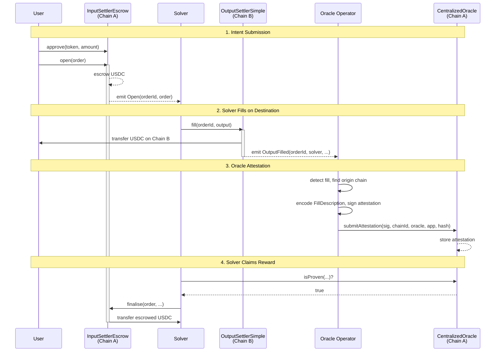
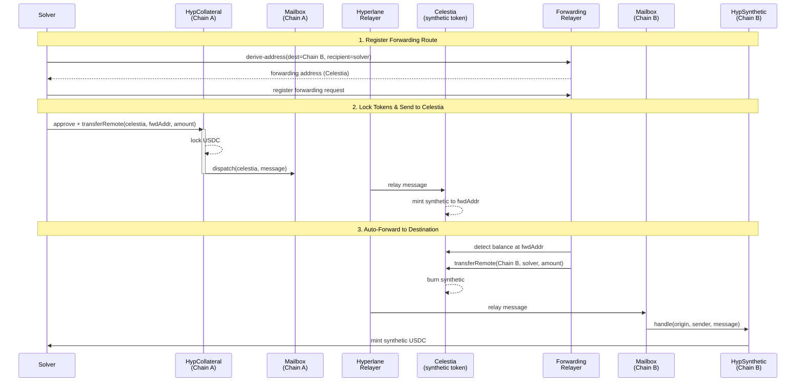

# OIF E2E Solver

Cross-chain intent solver supporting **any number of EVM chains**.

This CLI deploys OIF contracts, runs a solver, and executes cross-chain token transfers.

## Guides

| Guide                                              | Use Case                                            |
| -------------------------------------------------- | --------------------------------------------------- |
| [Deploy New Token](docs/deploy-new-token.md)       | Deploy a new token alongside USDC with Hyperlane     |
| [Add Chain: Sepolia](docs/add-chain-sepolia.md)    | Add Sepolia testnet to a running anvil1 + anvil2 setup |


## Prerequisites

- [Docker](https://docs.docker.com/get-docker/) - Local EVM chain
- [Foundry](https://book.getfoundry.sh/getting-started/installation) - `forge` and `cast`
- [Rust](https://rustup.rs/) - Build the CLI
- **Testnet ETH** - Get testnet ETH from a [faucet](https://sepoliafaucet.com)

## Quick Start: E2E Test

### Option 1: Direct to Chain (Simpler)

```bash
# 1. Start local EVM chain
make start

# 2. Configure environment
cp .env.example .env
# Edit .env with your SEPOLIA_PK (must have Sepolia ETH for gas!)

# 3. Full setup (build, deploy, configure, fund)
make clean && make setup

# 4. Start solver (in separate terminal)
make solver

# 5. Start oracle operator (in another separate terminal)
make operator

# 6. Submit intent and check balances (in original terminal)
make balances
make mint
make balances
make intent
make balances
```

### Option 2: With Aggregator (Recommended for Multi-Solver)

```bash
# 1-3. Same as above (start chain, configure, setup)

# 4. Start aggregator (Terminal 1)
make aggregator

# 5. Start solver (Terminal 2)
make solver

# 6. Start oracle operator (Terminal 3)
make operator

# 7. Use aggregator API or CLI
curl http://localhost:4000/api/v1/solvers
make intent
```

## Environment Setup

Chains are configured with the pattern `{CHAIN}_RPC` and `{CHAIN}_PK`:

```bash
cp .env.example .env
# Edit with your keys
```

See [Deploy New Token](docs/deploy-new-token.md) for detailed environment setup.

## Make Commands


| Command           | Description                                              |
| ----------------- | -------------------------------------------------------- |
| `make start`      | Start local EVM chain (Anvil)                            |
| `make stop`       | Stop Anvil, solver, operator, and aggregator             |
| `make setup`      | Full setup: init + deploy + configure + fund             |
| `make deploy`     | Deploy contracts (use `CHAINS=a,b` to limit)             |
| `make aggregator` | Start the OIF aggregator service (port 4000)             |
| `make solver`     | Start the solver service                                 |
| `make operator`   | Start the oracle operator service                        |
| `make mint`       | Mint mock tokens (`CHAIN=`, `SYMBOL=`, `TO=`, `AMOUNT=`) |
| `make intent`     | Submit intent (`FROM=`, `TO=`, `AMOUNT=`, `ASSET=`)      |
| `make balances`   | Check balances (use `CHAIN=name` to filter)              |
| `make chain-list` | List configured chains                                   |
| `make token-list` | List tokens across chains                                |
| `make clean`      | Remove generated files                                   |


Use `FORCE=1` to reinitialize or redeploy: `make setup FORCE=1`

Run `make help` to see all available commands.

## CLI Commands


| Command                                    | Description                           |
| ------------------------------------------ | ------------------------------------- |
| `solver-cli init`                          | Initialize project state              |
| `solver-cli deploy`                        | Deploy contracts to all chains        |
| `solver-cli deploy --chains a,b`           | Deploy to specific chains             |
| `solver-cli configure`                     | Generate solver config                |
| `solver-cli fund`                          | Fund solver with tokens on all chains |
| `solver-cli fund --chain X`                | Fund solver on specific chain         |
| `solver-cli chain add`                     | Add a chain with existing contracts   |
| `solver-cli chain list`                    | List configured chains                |
| `solver-cli token add`                     | Add a token to a chain                |
| `solver-cli token list`                    | List all tokens                       |
| `solver-cli token mint`                    | Mint mock tokens (MockERC20 only)     |
| `solver-cli solver start`                  | Start the solver                      |
| `solver-cli intent submit`                 | Submit a cross-chain intent           |
| `solver-cli intent submit --from a --to b` | Specify direction                     |
| `solver-cli balances`                      | Check balances on all chains              |


## Submitting Intents

```bash
# Default: 1 USDC from first chain to second
make intent

# Customize chain, token, amount
make intent FROM=sepolia TO=arbitrum ASSET=USDT AMOUNT=5000000

# Or use CLI directly
solver-cli intent submit --amount 1000000 --asset USDC --from anvil1 --to anvil2
```

**Token amounts use raw units** (e.g., USDC has 6 decimals: `1000000` = 1 USDC)

## OIF Aggregator

The aggregator provides multi-solver quote aggregation and order routing via a REST API.

**Quick Start:**
```bash
# Terminal 1
make aggregator

# Terminal 2
make solver

# Terminal 3
make operator
```

**Key Features:**
- Aggregate quotes from multiple solvers
- Best price selection
- Health monitoring with circuit breakers
- Per-solver order routing

**API endpoints:** `GET /api/v1/solvers`, `POST /api/v1/orders`, `GET /api/v1/quotes`

## How It Works

### Solving Flow

User submits a cross-chain intent on the origin chain. The solver fills it on the destination chain, an independent oracle operator attests the fill, and the solver claims the escrowed funds.



### Rebalancing via Celestia

After filling orders, the solver's funds accumulate on one chain. Rebalancing moves tokens back through Celestia as a hub using Hyperlane warp routes and a forwarding relayer.



## Contracts Deployed

- **MockERC20** - Mintable test token (USDC, etc.)
- **InputSettlerEscrow** - Escrows user tokens on origin chain
- **OutputSettlerSimple** - Handles delivery on destination chain
- **CentralizedOracle** - Verifies attestations from authorized operator

## Troubleshooting

### Oracle operator not running

The full flow requires the oracle operator to be running:

```bash
make operator
```

### Wrong solver address funded

The solver uses `SOLVER_PRIVATE_KEY`. Verify:

```bash
cast wallet address --private-key $SOLVER_PRIVATE_KEY
```

### Insufficient gas

Ensure your solver address has native tokens on all chains for gas.

## Development

```bash
# Build CLI
cd solver-cli && cargo build --release

# Run tests
cd solver-cli && cargo test

# Build contracts
cd oif/oif-contracts && forge build
```

