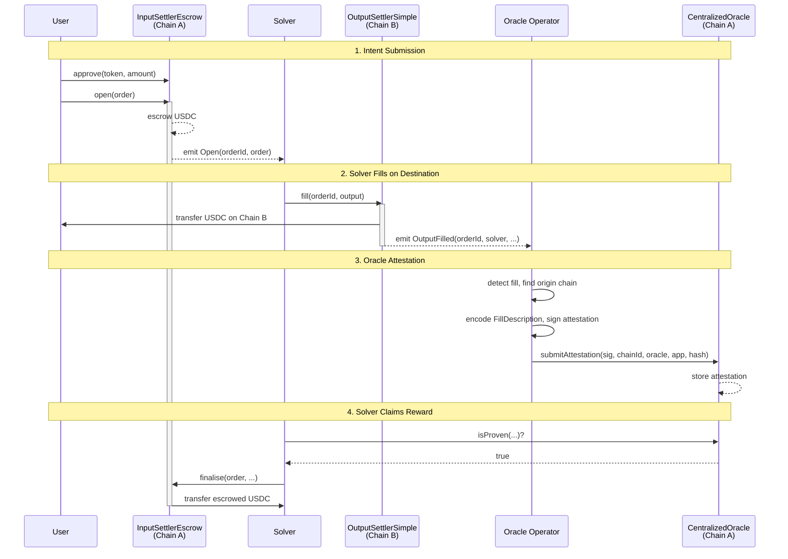
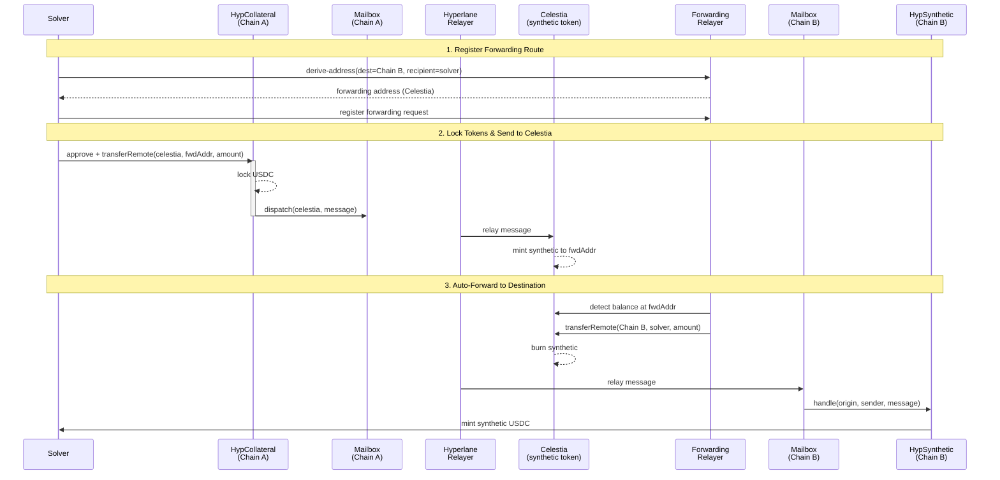

# OIF E2E Solver

Cross-chain intent solver supporting **any number of EVM chains**.

This CLI deploys OIF contracts, runs a solver, and executes cross-chain token transfers.

## Guides

| Guide                                              | Use Case                                            |
| -------------------------------------------------- | --------------------------------------------------- |
| [Deploy New Token](docs/deploy-new-token.md)       | Deploy a new token alongside USDC with Hyperlane     |
| [Add Chain: Sepolia](docs/add-chain-sepolia.md)    | Add Sepolia testnet to a running anvil1 + anvil2 setup |
| [Import Key to AWS KMS](docs/aws-kms-key-import.md) | Import an existing EVM key into AWS KMS for signer use |


## Prerequisites

- [Docker](https://docs.docker.com/get-docker/) - Local EVM chain
- [Foundry](https://book.getfoundry.sh/getting-started/installation) - `forge` and `cast`
- [Rust](https://rustup.rs/) - Build the CLI
- **Testnet ETH** - Get testnet ETH from a [faucet](https://sepoliafaucet.com)

## Quick Start

There are two paths: the **CLI walkthrough** (recommended — teaches you the wiring) and the **one-button demo** (for someone who just wants to see it run end-to-end).

### Path A — CLI walkthrough (recommended)

`make setup` deliberately stops after deploying contracts; you generate configs and fund accounts yourself with `solver-cli` so you understand each step. This is also the only way to wire **external chains** (Eden, Arbitrum, etc.) and **non-default tokens**.

```bash
# 1. Configure environment
cp .env.example .env
# Edit .env: per-chain {NAME}_RPC + {NAME}_PK, plus SOLVER_PRIVATE_KEY,
# REBALANCER_PRIVATE_KEY (== SOLVER_PRIVATE_KEY), ORACLE_OPERATOR_PK (≠ solver).

# 2. Start local Anvil chains + Hyperlane (Docker)
make start

# 3. Deploy OIF contracts to every chain in your .env
make setup
#    ↳ runs: init + deploy-permit2 + solver-cli deploy
#    ↳ writes .config/state.json with chain IDs, contract addresses,
#      and (for local stacks) Hyperlane warp router + token addresses
#      pulled from .config/hyperlane-addresses.json

# 4. Inspect what landed in state.json
solver-cli chain list
solver-cli token list

# 5. Generate the four service configs from state.json
solver-cli configure
#    ↳ writes: .config/solver.toml, .config/oracle.toml,
#              .config/rebalancer.toml, .config/aggregator.json
#    ↳ enforces every multi-chain asset has a Hyperlane warp router

# 6. Fund accounts (each one is explicit so you can see what's happening)
make fund            # mint USDC to the solver on the collateral chain
make fund-operator   # send ETH to the oracle operator on every chain
make fund-user       # send ETH to the test user on every chain

# 7. Start services (separate terminals)
make aggregator      # Terminal 1
make solver          # Terminal 2
make operator        # Terminal 3
make rebalancer      # Terminal 4 (optional)

# 8. Submit a test intent and watch balances
make balances
make intent
make balances
```

### Path B — one-button demo

```bash
make mvp             # spawns chains, deploys, configures, funds, starts every service
# ... or, without the frontend / services:
make setup-demo      # = setup + configure + fund + fund-operator + fund-user
```

`setup-demo` is the old all-in-one `setup` target; the new `setup` stops after deploy.

## Adding external chains

To wire a real testnet/mainnet (e.g. Eden, Arbitrum) you'll use `solver-cli chain add` and `solver-cli token add`. There is no Docker step — the chain already exists.

```bash
# 1. Add the chain to .env (CLI auto-detects from {NAME}_RPC + {NAME}_PK):
echo 'EDEN_RPC=https://eden-rpc.example.com'         >> .env
echo 'EDEN_PK=0x...your-deployer-key...'             >> .env

# Optional: if Eden's Hyperlane domain ID differs from its EVM chain ID, also:
echo 'EDEN_DOMAIN_ID=12345'                          >> .env

# 2. (Option A) Deploy OIF contracts on Eden:
solver-cli deploy --chains eden

# 2. (Option B) If contracts are already deployed, register them:
solver-cli chain add \
  --name eden \
  --rpc https://eden-rpc.example.com \
  --input-settler 0x... \
  --output-settler 0x... \
  --oracle 0x... \
  --domain-id 12345 \
  --mailbox 0x... \
  --igp 0x... \
  --warp-token 0x...HypERC20Collateral... \
  --warp-token-type collateral

# 3. Add a token. For an ERC20 with its own Hyperlane warp route:
solver-cli token add \
  --chain eden \
  --symbol USDC \
  --address 0x...UnderlyingERC20... \
  --decimals 6 \
  --token-type erc20 \
  --warp-token 0x...HypERC20Collateral... \
  --warp-token-type collateral

# For a synthetic chain (router IS the ERC20), pass the same address as both:
solver-cli token add --chain eden --symbol USDC \
  --address 0x...HypSynthetic... --decimals 6 \
  --warp-token 0x...HypSynthetic... --warp-token-type synthetic

# For a native warp route (HypNative wraps ETH):
solver-cli token add --chain eden --symbol ETH \
  --address 0x0000000000000000000000000000000000000000 \
  --decimals 18 --token-type native \
  --warp-token 0x...HypNative... --warp-token-type native

# 4. Regenerate configs
solver-cli configure
```

### Finding the addresses you need

| Address | Where to get it |
| --- | --- |
| Hyperlane mailbox / IGP / warp routers on real chains | Hyperlane registry: <https://github.com/hyperlane-xyz/hyperlane-registry/tree/main/chains> |
| Hyperlane domain ID | Same registry — `metadata.yaml` has `domainId`. Defaults to chain ID if you don't override. |
| Deployed OIF contracts on local stack | `solver-cli chain list` (reads `.config/state.json` written by `make setup`) |
| Token contract addresses | Token issuer docs, block explorer, or — for newly deployed warp routes — `cast call <warp> "wrappedToken()(address)"` |
| Underlying ERC20 vs warp router | On a **collateral** chain they differ; `cast call <HypCollateral> "wrappedToken()(address)"` returns the underlying ERC20. On a **synthetic** chain they are the same contract. |

### Per-token vs chain-level warp router

- The chain-level `--warp-token` on `chain add` is a **default** for every token on that chain.
- The per-token `--warp-token` on `token add` is **per-asset** and overrides the chain-level value.
- You need the per-token form when one chain has multiple tokens with different warp routers (e.g. USDC and USDT each on their own `HypERC20Collateral`).

## Environment Setup

Chains are configured with the pattern `{CHAIN}_RPC` and `{CHAIN}_PK`:

```bash
cp .env.example .env
# Edit with your keys
```

See [Deploy New Token](docs/deploy-new-token.md) for detailed environment setup.

Oracle operator signer defaults to env-backed config. Generated `.config/oracle.toml` now contains:

```toml
operator_address = "0x..."

[signer]
type = "env"
```

When `type = "env"`, the operator loads `ORACLE_OPERATOR_PK` at runtime (for example via `.env`).

## Make Commands


| Command            | Description                                                  |
| ------------------ | ------------------------------------------------------------ |
| `make start`       | Start local Anvil chains + Hyperlane (Docker)                |
| `make stop`        | Stop Docker stack + solver + operator + aggregator           |
| `make setup`       | **Deploys contracts only** — no configure or fund. Run the follow-up steps yourself. |
| `make setup-demo`  | One-button: `setup` + `configure` + `fund` + `fund-operator` + `fund-user`. |
| `make deploy`      | Deploy contracts (use `CHAINS=a,b` to limit)                 |
| `make configure`   | Generate `.config/{solver,oracle,rebalancer,aggregator}.*`   |
| `make fund`        | Fund solver with USDC on the collateral chain                |
| `make fund-operator` | Send ETH to oracle operator on every chain                 |
| `make fund-user`   | Send ETH to user on every chain                              |
| `make aggregator`  | Start OIF aggregator (port 4000)                             |
| `make solver`      | Start solver service                                         |
| `make operator`    | Start oracle operator                                        |
| `make rebalancer`  | Start rebalancer                                             |
| `make mint`        | Mint mock tokens (`CHAIN=`, `SYMBOL=`, `TO=`, `AMOUNT=`)     |
| `make intent`      | Submit intent (`FROM=`, `TO=`, `AMOUNT=`, `ASSET=`)          |
| `make balances`    | Check balances (use `CHAIN=name` to filter)                  |
| `make chain-list`  | List configured chains                                       |
| `make token-list`  | List tokens across chains                                    |
| `make clean`       | Remove generated files                                       |


Use `FORCE=1` to reinitialize or redeploy: `make setup FORCE=1` or `make setup-demo FORCE=1`.

Run `make help` to see all available commands.

## CLI Commands


| Command                                    | Description                                                  |
| ------------------------------------------ | ------------------------------------------------------------ |
| `solver-cli init`                          | Initialize project state                                     |
| `solver-cli deploy`                        | Deploy contracts to all chains in `.env`                     |
| `solver-cli deploy --chains a,b`           | Deploy to specific chains                                    |
| `solver-cli configure`                     | Generate `solver.toml` / `oracle.toml` / `rebalancer.toml` / `aggregator.json` |
| `solver-cli fund`                          | Fund solver with tokens on all chains                        |
| `solver-cli fund --chain X`                | Fund solver on a specific chain                              |
| `solver-cli chain add`                     | Register a chain. Flags: `--rpc`, `--chain-id`, `--input-settler`, `--output-settler`, `--oracle`, `--warp-token`, `--warp-token-type`, `--mailbox`, `--igp`, `--domain-id` |
| `solver-cli chain list`                    | List configured chains                                       |
| `solver-cli token add`                     | Add a token. Flags: `--chain`, `--symbol`, `--address`, `--decimals`, `--token-type`, `--warp-token`, `--warp-token-type` |
| `solver-cli token list`                    | List all tokens                                              |
| `solver-cli token mint`                    | Mint mock tokens (MockERC20 only)                            |
| `solver-cli solver start`                  | Start the solver                                             |
| `solver-cli intent submit`                 | Submit a cross-chain intent                                  |
| `solver-cli intent submit --from a --to b` | Specify direction                                            |
| `solver-cli balances`                      | Check balances on all chains                                 |

### Hyperlane domain ID override

A chain's Hyperlane domain ID defaults to its EVM chain ID. Override per chain via either:
- env var: `EDEN_DOMAIN_ID=12345` (used by `solver-cli deploy`)
- CLI flag: `solver-cli chain add --domain-id 12345`


## Submitting Intents

```bash
# Default: 1 USDC from first chain to second
make intent

# Customize chain, token, amount
make intent FROM=sepolia TO=arbitrum ASSET=USDT AMOUNT=5000000

# Or use CLI directly
solver-cli intent submit --amount 1000000 --asset USDC --from anvil1 --to anvil2
```

**Token amounts use raw units** (e.g., USDC has 6 decimals: `1000000` = 1 USDC)

## OIF Aggregator

The aggregator provides multi-solver quote aggregation and order routing via a REST API.

**Quick Start:**
```bash
# Terminal 1
make aggregator

# Terminal 2
make solver

# Terminal 3
make operator
```

**Key Features:**
- Aggregate quotes from multiple solvers
- Best price selection
- Health monitoring with circuit breakers
- Per-solver order routing

**API endpoints:** `GET /api/v1/solvers`, `POST /api/v1/orders`, `GET /api/v1/quotes`

## How It Works

### Solving Flow

User submits a cross-chain intent on the origin chain. The solver fills it on the destination chain, an independent oracle operator attests the fill, and the solver claims the escrowed funds.


```mermaid
sequenceDiagram
    participant User
    participant ISE as InputSettlerEscrow<br/>(Chain A)
    participant Solver
    participant OSS as OutputSettlerSimple<br/>(Chain B)
    participant OO as Oracle Operator
    participant Oracle as CentralizedOracle<br/>(Chain A)

    Note over User,Oracle: 1. Intent Submission
    User->>ISE: approve(token, amount)
    User->>ISE: open(order)
    activate ISE
    ISE-->>ISE: escrow USDC
    ISE-->>Solver: emit Open(orderId, order)

    Note over User,Oracle: 2. Solver Fills on Destination
    Solver->>OSS: fill(orderId, output)
    activate OSS
    OSS->>User: transfer USDC on Chain B
    OSS-->>OO: emit OutputFilled(orderId, solver, ...)
    deactivate OSS

    Note over User,Oracle: 3. Oracle Attestation
    OO->>OO: detect fill, find origin chain
    OO->>OO: encode FillDescription, sign attestation
    OO->>Oracle: submitAttestation(sig, chainId, oracle, app, hash)
    Oracle-->>Oracle: store attestation

    Note over User,Oracle: 4. Solver Claims Reward
    Solver->>Oracle: isProven(...)?
    Oracle-->>Solver: true
    Solver->>ISE: finalise(order, ...)
    ISE->>Solver: transfer escrowed USDC
    deactivate ISE
```

### Rebalancing via Celestia

After filling orders, the solver's funds accumulate on one chain. Rebalancing moves tokens back through Celestia as a hub using Hyperlane warp routes and a forwarding relayer.


```mermaid
sequenceDiagram
    participant Solver
    participant HC as HypCollateral<br/>(Chain A)
    participant MB1 as Mailbox<br/>(Chain A)
    participant HR as Hyperlane<br/>Relayer
    participant Cel as Celestia<br/>(synthetic token)
    participant FR as Forwarding<br/>Relayer
    participant MB2 as Mailbox<br/>(Chain B)
    participant HS as HypSynthetic<br/>(Chain B)

    Note over Solver,HS: 1. Register Forwarding Route
    Solver->>FR: derive-address(dest=Chain B, recipient=solver)
    FR-->>Solver: forwarding address (Celestia)
    Solver->>FR: register forwarding request

    Note over Solver,HS: 2. Lock Tokens & Send to Celestia
    Solver->>HC: approve + transferRemote(celestia, fwdAddr, amount)
    activate HC
    HC-->>HC: lock USDC
    HC->>MB1: dispatch(celestia, message)
    deactivate HC
    HR->>Cel: relay message
    Cel-->>Cel: mint synthetic to fwdAddr

    Note over Solver,HS: 3. Auto-Forward to Destination
    FR->>Cel: detect balance at fwdAddr
    FR->>Cel: transferRemote(Chain B, solver, amount)
    Cel-->>Cel: burn synthetic
    HR->>MB2: relay message
    MB2->>HS: handle(origin, sender, message)
    HS->>Solver: mint synthetic USDC
```

## Contracts Deployed

- **MockERC20** - Mintable test token (USDC, etc.)
- **InputSettlerEscrow** - Escrows user tokens on origin chain
- **OutputSettlerSimple** - Handles delivery on destination chain
- **CentralizedOracle** - Verifies attestations from authorized operator

## Troubleshooting

### Oracle operator not running

The full flow requires the oracle operator to be running:

```bash
make operator
```

### Wrong solver address funded

The solver uses `SOLVER_PRIVATE_KEY`. Verify:

```bash
cast wallet address --private-key $SOLVER_PRIVATE_KEY
```

### Insufficient gas

Ensure your solver address has native tokens on all chains for gas.

## Development

```bash
# Rustup will honor .rust-toolchain.toml automatically in this repo.
# To preinstall it explicitly:
rustup toolchain install 1.91.1 --component rustfmt --component clippy

# Format all workspace crates
make fmt

# Run the same Rust quality checks as CI
make ci-rust

# Build the main CLI
make build

# Run individual checks
make fmt-check
make lint
make test-rust

# Build contracts
cd oif/oif-contracts && forge build
```
