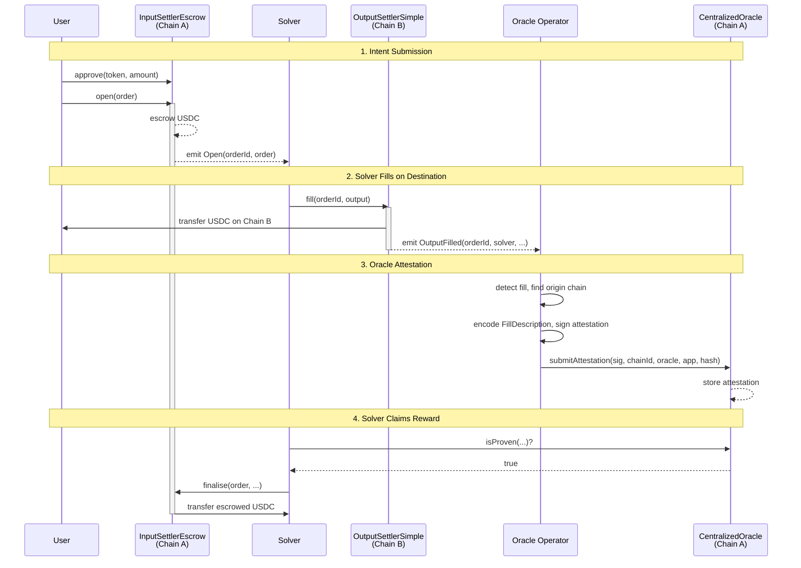
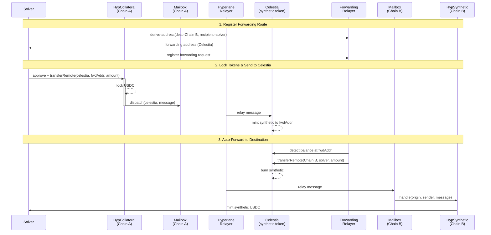

# OIF E2E Solver

Cross-chain intent solver supporting **any number of EVM chains**.

This CLI deploys OIF contracts, runs a solver, and executes cross-chain token transfers.

## Guides

| Guide                                              | Use Case                                            |
| -------------------------------------------------- | --------------------------------------------------- |
| [Deploy New Token](docs/deploy-new-token.md)       | Deploy a new token alongside USDC with Hyperlane     |
| [Add Chain: Sepolia](docs/add-chain-sepolia.md)    | Add Sepolia testnet to a running anvil1 + anvil2 setup |
| [Import Key to AWS KMS](docs/aws-kms-key-import.md) | Import an existing EVM key into AWS KMS for signer use |


## Prerequisites

- [Docker](https://docs.docker.com/get-docker/) - Local EVM chain
- [Foundry](https://book.getfoundry.sh/getting-started/installation) - `forge` and `cast`
- [Rust](https://rustup.rs/) - Build the CLI
- **Testnet ETH** - Get testnet ETH from a [faucet](https://sepoliafaucet.com)

## Quick Start

Pick one path:

- **Path A — Local Anvil walkthrough.** Two-chain Docker stack. Best for learning the flow end-to-end and for development.
- **Path B — Real EVM chains (Sepolia/Eden/Arbitrum/...).** Skip Docker; deploy or register contracts on existing chains.
- **Path C — One-button demo.** Hands-off local stack with everything started for you.

### Prep (all paths)

```bash
# Build the CLI binary (target/release/solver-cli)
make build

# Put solver-cli on PATH for the rest of this session.
# Pick one:
export PATH="$PWD/target/release:$PATH"            # quick session-only
# alias solver-cli="$PWD/target/release/solver-cli"  # alternative
# cargo install --path solver-cli                    # ~/.cargo/bin (persistent)

# Environment
cp .env.example .env
# Edit .env. Required:
#   per-chain {NAME}_RPC + {NAME}_PK   (e.g. SEPOLIA_RPC, SEPOLIA_PK)
#   SOLVER_PRIVATE_KEY                 (== REBALANCER_PRIVATE_KEY)
#   ORACLE_OPERATOR_PK                 (must differ from SOLVER_PRIVATE_KEY)
#   USER_PK                            (test-user wallet)
#   INTEGRITY_SECRET                   (32+ random chars, for the aggregator)
```

### Path A — Local Anvil walkthrough

`make setup` stops after deploying contracts so you can see each follow-up step on its own.

```bash
# 1. Start Docker stack (Anvil1, Anvil2, Hyperlane init, forwarding relayer)
make start

# 2. Deploy OIF contracts on both Anvil chains
make setup
#    ↳ runs: init + deploy-permit2 + solver-cli deploy
#    ↳ writes .config/state.json with chain IDs, contract addresses, and
#      Hyperlane warp router + token addresses pulled from
#      .config/hyperlane-addresses.json (created by `make start`)

# 3. Inspect state
solver-cli chain list
solver-cli token list

# 4. Generate the four service configs from state.json
solver-cli configure
#    ↳ writes .config/solver.toml, .config/oracle.toml,
#             .config/rebalancer.toml, .config/aggregator.json

# 5. Fund accounts
make fund            # mint USDC to the solver on anvil1 (collateral chain)
make fund-operator   # ETH to oracle operator on every chain
make fund-user       # ETH to test user on every chain

# 6. Start services in separate terminals
make aggregator      # T1
make solver          # T2
make operator        # T3
make rebalancer      # T4 (optional — Celestia rebalance loop)

# 7. Submit intent + watch balances
make balances
make intent
make balances
```

### Path B — Real EVM chains (no Docker)

For a public testnet/mainnet, **do not run `make start`** — the Docker stack is local-only. Skip straight to `solver-cli deploy` (or `chain add` if contracts already exist), then add tokens, configure, and fund manually with `cast send` / your wallet.

```bash
# 1. Add the chain(s) to .env (auto-detected via {NAME}_RPC + {NAME}_PK).
#    Optional: {NAME}_DOMAIN_ID if Hyperlane domain ≠ chain ID.
echo 'EDEN_RPC=https://eden-rpc.example'  >> .env
echo 'EDEN_PK=0x<deployer-key>'           >> .env
# echo 'EDEN_DOMAIN_ID=12345'             >> .env   # only if needed

solver-cli init

# 2a. Deploy fresh OIF contracts on each chain
solver-cli deploy --chains sepolia,eden --token ETH --decimals 18

# 2b. ...OR register existing deployments (one chain per invocation):
solver-cli chain add \
  --name eden --rpc "$EDEN_RPC" \
  --input-settler 0x... --output-settler 0x... --oracle 0x... \
  --domain-id 12345 \
  --mailbox 0x<eden-mailbox> \
  --igp 0x<eden-igp>

# 3. Add tokens. Pick the right warp_token_type for each chain:
#    collateral = HypERC20Collateral wraps a vanilla ERC20 (two distinct addresses)
#    synthetic  = HypERC20Synthetic IS the ERC20 (same address in both fields)
#    native     = HypNative wraps the chain's gas token (no underlying ERC20)
solver-cli token add --chain sepolia --symbol ETH \
  --address 0x<sepolia-warp> --decimals 18 --token-type erc20 \
  --warp-token 0x<sepolia-warp> --warp-token-type synthetic
solver-cli token add --chain eden --symbol ETH \
  --address 0x<eden-warp> --decimals 18 --token-type erc20 \
  --warp-token 0x<eden-warp> --warp-token-type synthetic

# 4. Generate configs
solver-cli configure

# 5. Fund manually — `make fund` is anvil-only.
#    Send native gas + token inventory to:
#      - SOLVER_PRIVATE_KEY's address on every chain (gas + inventory on dest)
#      - ORACLE_OPERATOR_PK's address on every chain (gas only)
#      - USER_PK's address on the source chain (gas + tokens for the test intent)
#    With `cast`:
cast send --rpc-url "$EDEN_RPC" --private-key "$EDEN_PK" \
  --value 0.05ether $(cast wallet address --private-key "$SOLVER_PRIVATE_KEY")
# ...or any wallet UI works.

# 6. Start services (same as Path A step 6)
make aggregator
make solver
make operator
make rebalancer
make frontend       # optional — http://localhost:3000

# 7. Submit + verify
solver-cli intent submit --asset ETH --from sepolia --to eden --amount 100000000000000000   # 0.1 ETH
solver-cli balances
```

### Path C — One-button local demo

```bash
make mvp          # full Docker stack + every service + frontend
# ...or just the wiring without the services / frontend:
make setup-demo   # = setup + configure + fund + fund-operator + fund-user
```

`setup-demo` is the old all-in-one `setup`; the new `setup` stops after deploy.

## Reference

### Hyperlane warp router types

| Type | Underlying ERC20 (`token.address`) | Warp router (`warp_token`) | Set `token-type` to | Set `warp-token-type` to |
| --- | --- | --- | --- | --- |
| **Collateral** | vanilla ERC20 (e.g. real USDC) | separate `HypERC20Collateral` | `erc20` | `collateral` |
| **Synthetic** | router IS the ERC20 (same address) | same address | `erc20` | `synthetic` |
| **Native** | none — gas token (`0x0..0` placeholder) | `HypNative` | `native` | `native` |

### Finding the addresses you need

| Address | Source |
| --- | --- |
| Hyperlane mailbox / IGP / warp routers on real chains | Hyperlane registry: <https://github.com/hyperlane-xyz/hyperlane-registry/tree/main/chains> |
| Hyperlane domain ID | Same registry — `metadata.yaml` has `domainId`. Defaults to chain ID if you don't override. |
| Deployed OIF contracts on local stack | `solver-cli chain list` (reads `.config/state.json` written by `make setup`) |
| Local-stack Hyperlane addresses | `.config/hyperlane-addresses.json` (created by `make start`) |
| Token contract addresses | Token issuer docs, block explorer, or — for warp routes — `cast call <warp> "wrappedToken()(address)"` |
| Underlying ERC20 vs warp router | On a **collateral** chain they differ; `cast call <HypCollateral> "wrappedToken()(address)"` returns the underlying ERC20. On a **synthetic** chain they are the same contract. |

### Per-token vs chain-level warp router

- The chain-level `--warp-token` on `chain add` is a **default** for every token on that chain.
- The per-token `--warp-token` on `token add` is **per-asset** and overrides the chain-level value.
- You need the per-token form when one chain has multiple tokens with different warp routers (e.g. USDC and USDT each on their own `HypERC20Collateral`).

## Environment

Chains are auto-detected from `{NAME}_RPC` + `{NAME}_PK` pairs in `.env`. See [Deploy New Token](docs/deploy-new-token.md) for an end-to-end example. The oracle operator signer defaults to `type = "env"` (loads `ORACLE_OPERATOR_PK`); switch to AWS KMS by setting `ORACLE_SIGNER_TYPE=aws_kms` + `ORACLE_KMS_KEY_ID` + `ORACLE_KMS_REGION`. Same pattern for `SOLVER_SIGNER_TYPE` and `REBALANCER_SIGNER_TYPE`.

## Make Commands


**Anvil-only** = depends on the local Docker stack (`make start`).

| Command              | Description                                                       |
| -------------------- | ----------------------------------------------------------------- |
| `make build`         | Build the `solver-cli` binary (`target/release/solver-cli`)       |
| `make start`         | **Anvil-only.** Start Docker chains + Hyperlane                   |
| `make stop`          | Stop Docker stack + every running service                         |
| `make setup`         | **Deploys contracts only.** Run `solver-cli configure` and the fund targets yourself. |
| `make setup-demo`    | **Anvil-only.** `setup` + `configure` + `fund` + `fund-operator` + `fund-user`. |
| `make mvp`           | **Anvil-only.** Full Docker + every service + frontend.           |
| `make deploy`        | `solver-cli deploy` (use `CHAINS=a,b` to limit)                   |
| `make configure`     | `solver-cli configure`                                            |
| `make fund`          | **Anvil-only.** Mint USDC to solver on anvil1 (hardcoded). For external chains, fund manually with `cast send` or your wallet. |
| `make fund-operator` | **Anvil-only.** Send ETH to oracle operator on anvil1/anvil2.     |
| `make fund-user`     | **Anvil-only.** Send ETH to user on anvil1/anvil2.                |
| `make chain-add`     | `solver-cli chain add` wrapper. Vars: `NAME`, `RPC`, `INPUT_SETTLER`, `OUTPUT_SETTLER`, `ORACLE`, optional `CHAIN_ID`, `DOMAIN_ID`, `MAILBOX`, `IGP`, `WARP_TOKEN`, `WARP_TOKEN_TYPE`. |
| `make token-add`     | `solver-cli token add` wrapper. Vars: `CHAIN`, `SYMBOL`, `ADDRESS`, optional `DECIMALS`, `TOKEN_TYPE`, `WARP_TOKEN`, `WARP_TOKEN_TYPE`. |
| `make aggregator`    | Start OIF aggregator (port 4000)                                  |
| `make solver`        | Start solver service                                              |
| `make operator`      | Start oracle operator                                             |
| `make rebalancer`    | Start rebalancer                                                  |
| `make mint`          | **Anvil-only.** Mint mock tokens (`CHAIN=`, `SYMBOL=`, `TO=`, `AMOUNT=`) |
| `make intent`        | Submit intent (`FROM=`, `TO=`, `AMOUNT=`, `ASSET=`)               |
| `make balances`      | Check balances (use `CHAIN=name` to filter)                       |
| `make chain-list`    | List configured chains                                            |
| `make token-list`    | List tokens across chains                                         |
| `make clean`         | Remove generated files                                            |


Use `FORCE=1` to reinitialize or redeploy: `make setup FORCE=1` or `make setup-demo FORCE=1`.

Run `make help` to see all available commands.

## CLI Commands


| Command                                    | Description                                                  |
| ------------------------------------------ | ------------------------------------------------------------ |
| `solver-cli init`                          | Initialize project state                                     |
| `solver-cli deploy`                        | Deploy contracts to all chains in `.env`                     |
| `solver-cli deploy --chains a,b`           | Deploy to specific chains                                    |
| `solver-cli configure`                     | Generate `solver.toml` / `oracle.toml` / `rebalancer.toml` / `aggregator.json` |
| `solver-cli fund`                          | Fund solver with tokens on all chains                        |
| `solver-cli fund --chain X`                | Fund solver on a specific chain                              |
| `solver-cli chain add`                     | Register a chain. Flags: `--rpc`, `--chain-id`, `--input-settler`, `--output-settler`, `--oracle`, `--warp-token`, `--warp-token-type`, `--mailbox`, `--igp`, `--domain-id` |
| `solver-cli chain list`                    | List configured chains                                       |
| `solver-cli token add`                     | Add a token. Flags: `--chain`, `--symbol`, `--address`, `--decimals`, `--token-type`, `--warp-token`, `--warp-token-type` |
| `solver-cli token list`                    | List all tokens                                              |
| `solver-cli token mint`                    | Mint mock tokens (MockERC20 only)                            |
| `solver-cli solver start`                  | Start the solver                                             |
| `solver-cli intent submit`                 | Submit a cross-chain intent                                  |
| `solver-cli intent submit --from a --to b` | Specify direction                                            |
| `solver-cli balances`                      | Check balances on all chains                                 |

### Hyperlane domain ID override

A chain's Hyperlane domain ID defaults to its EVM chain ID. Override per chain via either:
- env var: `EDEN_DOMAIN_ID=12345` (used by `solver-cli deploy`)
- CLI flag: `solver-cli chain add --domain-id 12345`


## Submitting Intents

```bash
# Default: 1 USDC from first chain to second
make intent

# Customize chain, token, amount
make intent FROM=sepolia TO=arbitrum ASSET=USDT AMOUNT=5000000

# Or use CLI directly
solver-cli intent submit --amount 1000000 --asset USDC --from anvil1 --to anvil2
```

**Token amounts use raw units** (e.g., USDC has 6 decimals: `1000000` = 1 USDC)

## OIF Aggregator

The aggregator provides multi-solver quote aggregation and order routing via a REST API.

**Quick Start:**
```bash
# Terminal 1
make aggregator

# Terminal 2
make solver

# Terminal 3
make operator
```

**Key Features:**
- Aggregate quotes from multiple solvers
- Best price selection
- Health monitoring with circuit breakers
- Per-solver order routing

**API endpoints:** `GET /api/v1/solvers`, `POST /api/v1/orders`, `GET /api/v1/quotes`

## How It Works

### Solving Flow

User submits a cross-chain intent on the origin chain. The solver fills it on the destination chain, an independent oracle operator attests the fill, and the solver claims the escrowed funds.


```mermaid
sequenceDiagram
    participant User
    participant ISE as InputSettlerEscrow<br/>(Chain A)
    participant Solver
    participant OSS as OutputSettlerSimple<br/>(Chain B)
    participant OO as Oracle Operator
    participant Oracle as CentralizedOracle<br/>(Chain A)

    Note over User,Oracle: 1. Intent Submission
    User->>ISE: approve(token, amount)
    User->>ISE: open(order)
    activate ISE
    ISE-->>ISE: escrow USDC
    ISE-->>Solver: emit Open(orderId, order)

    Note over User,Oracle: 2. Solver Fills on Destination
    Solver->>OSS: fill(orderId, output)
    activate OSS
    OSS->>User: transfer USDC on Chain B
    OSS-->>OO: emit OutputFilled(orderId, solver, ...)
    deactivate OSS

    Note over User,Oracle: 3. Oracle Attestation
    OO->>OO: detect fill, find origin chain
    OO->>OO: encode FillDescription, sign attestation
    OO->>Oracle: submitAttestation(sig, chainId, oracle, app, hash)
    Oracle-->>Oracle: store attestation

    Note over User,Oracle: 4. Solver Claims Reward
    Solver->>Oracle: isProven(...)?
    Oracle-->>Solver: true
    Solver->>ISE: finalise(order, ...)
    ISE->>Solver: transfer escrowed USDC
    deactivate ISE
```

### Rebalancing via Celestia

After filling orders, the solver's funds accumulate on one chain. Rebalancing moves tokens back through Celestia as a hub using Hyperlane warp routes and a forwarding relayer.


```mermaid
sequenceDiagram
    participant Solver
    participant HC as HypCollateral<br/>(Chain A)
    participant MB1 as Mailbox<br/>(Chain A)
    participant HR as Hyperlane<br/>Relayer
    participant Cel as Celestia<br/>(synthetic token)
    participant FR as Forwarding<br/>Relayer
    participant MB2 as Mailbox<br/>(Chain B)
    participant HS as HypSynthetic<br/>(Chain B)

    Note over Solver,HS: 1. Register Forwarding Route
    Solver->>FR: derive-address(dest=Chain B, recipient=solver)
    FR-->>Solver: forwarding address (Celestia)
    Solver->>FR: register forwarding request

    Note over Solver,HS: 2. Lock Tokens & Send to Celestia
    Solver->>HC: approve + transferRemote(celestia, fwdAddr, amount)
    activate HC
    HC-->>HC: lock USDC
    HC->>MB1: dispatch(celestia, message)
    deactivate HC
    HR->>Cel: relay message
    Cel-->>Cel: mint synthetic to fwdAddr

    Note over Solver,HS: 3. Auto-Forward to Destination
    FR->>Cel: detect balance at fwdAddr
    FR->>Cel: transferRemote(Chain B, solver, amount)
    Cel-->>Cel: burn synthetic
    HR->>MB2: relay message
    MB2->>HS: handle(origin, sender, message)
    HS->>Solver: mint synthetic USDC
```

## Contracts Deployed

- **MockERC20** - Mintable test token (USDC, etc.)
- **InputSettlerEscrow** - Escrows user tokens on origin chain
- **OutputSettlerSimple** - Handles delivery on destination chain
- **CentralizedOracle** - Verifies attestations from authorized operator

## Troubleshooting

### Oracle operator not running

The full flow requires the oracle operator to be running:

```bash
make operator
```

### Wrong solver address funded

The solver uses `SOLVER_PRIVATE_KEY`. Verify:

```bash
cast wallet address --private-key $SOLVER_PRIVATE_KEY
```

### Insufficient gas

Ensure your solver address has native tokens on all chains for gas.

## Development

```bash
# Rustup will honor .rust-toolchain.toml automatically in this repo.
# To preinstall it explicitly:
rustup toolchain install 1.91.1 --component rustfmt --component clippy

# Format all workspace crates
make fmt

# Run the same Rust quality checks as CI
make ci-rust

# Build the main CLI
make build

# Run individual checks
make fmt-check
make lint
make test-rust

# Build contracts
cd oif/oif-contracts && forge build
```
